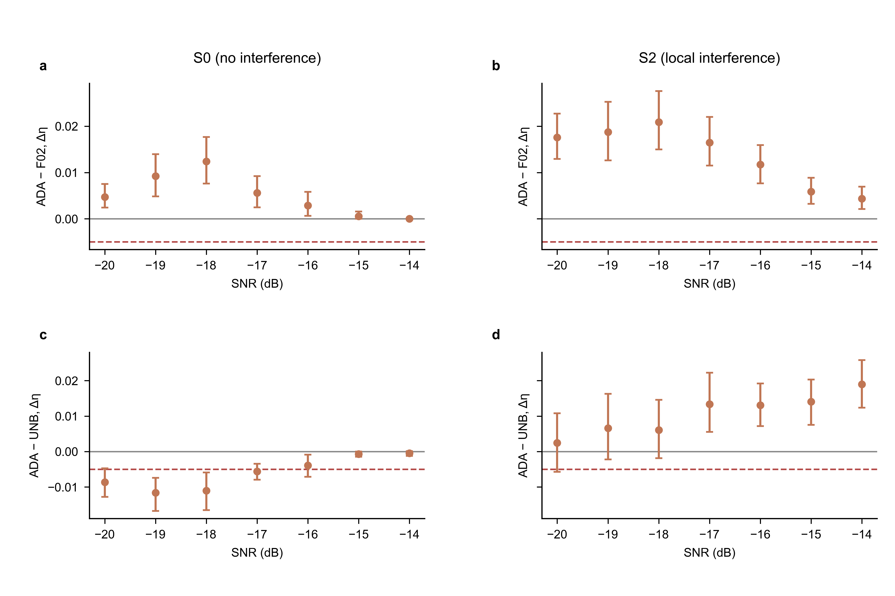
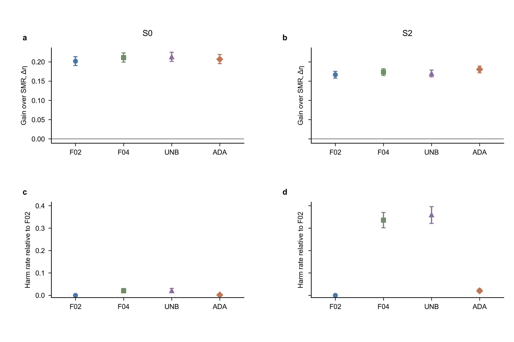

# Phase D 确认报告：C-A1

协议 ASL-D-20261003；phase 52；2026-10-04 用户放行后执行。状态：**停止点 2，等待用户核对；X1–X3 未开始。**

## 1. 预登记终点与分支

FM 为开发冻结的 `ADA_local_c04_t30_A`。判定严格采用主方案 §6.3、§6.4 与优先适用的补充文件；无确认后改参数。

| 终点 | 预登记规则 | 估计值 | 95% CI | 判定 |
| --- | --- | --- | --- | --- |
| P1 | FM−F02 合并 Δη 的 95% CI 下界 > 0 | 0.009348 | [0.008078, 0.010685] | 通过 |
| P2 | FM−UNB 合并 Δη 的 95% CI 下界 > −0.005 | 0.002339 | [0.000059, 0.004814] | 通过 |
| P3 | H_FM−H_UNB 的 95% CI 上界 < 0 | -0.179286 | [-0.197500, -0.160714] | 通过 |
| S1 | 不存在 FM−F02 单元 Δη 的 95% CI 上界 < −0.005 的单元 | 退化单元 0/14 | 见完整单元表 | 通过 |

**正式分支：C-A1。** P1、P2、P3、S1 全部满足，按 §6.4 自适应作为主方法。

后续主方法：`ADA_local_c04_t30_A`。 后续实验仍需停止点 2 放行。

## 2. 完整性与冻结配置

S0/S2 × SNR −20:−14 dB × record_id 1–200：2,800 条新记录、400 个场景内种子簇、五种方法各 2,800 条，共 14,000 行。T=300 s；评价区间 [5,295) s；20 Hz。SMR、F02、F04、UNB 和 FM 均在同记录上配对。没有删除记录、追加预算或重试求解。

Δ=10 s，31 个节点，r=0.02 Hz；λ_C=0.005151315789473684，λ_F=0.5151315789473684；各阶段预算为 354 次迭代 / 1,476 次目标调用；三阶段块长 20/60/290 s；步长与最优性容差均为 10⁻⁶。SMR 始终固定 ±0.02 Hz；F04 的系数界为 ±2；UNB 只去掉系数盒界，保留全局频带约束。

FM 以同记录 F02 为第 0 轮；最长 0.95 倍边界驻留 ≥30 s 时，只将受影响帽函数支撑节点及其相邻节点从 ±1 升至 ±2；从上一轮解重跑完整三阶段，上一解显式进入候选，候选只按全长目标 J 选择。最多一次扩张。未触发记录与 F02 逐位相同；所有记录 FM 的全长 J 均未下降。

种子为 `20260915 + 52×10^6 + scene_code×10^4 + record_id`（S0=1，S2=3），与开发 phase 51 无交集，亦不使用 E4a 记录。

## 3. 统计实现

所有判定使用未四舍五入数值；表中均值与区间显示六位小数。

2,000 次配对 bootstrap；2.5/97.5 百分位。随机种子 20261052，NumPy PCG64。先依 S0、S2 顺序生成两个 2000×200 的场景内种子重采样数组，同种子携带七个 SNR；合并值为 14 个单元均值等权平均。分场景值为七个单元等权平均。随后按 scene、SNR 顺序生成 14 个 2000×200 单元内配对重采样数组。各配对指标共用对应抽样数组，保存在 `bootstrap_draws.npz`。

P3 直接重采样同记录的二元伤害指标之差，H_method 定义为 η_method < η_F02−0.01；没有把两个独立 CI 相减。S1 只检查单元 CI 上界 <−0.005，未要求每个单元正向显著。不作联合多重比较校正，也不将单元数量作为显著性结论。

全部 η 和主终点均要求有限；若次要 3 dB 宽度数学上未定义，保留该记录，并单独报告有效数，仅该次要均值按有效值计算。软件版本：Python 3.10.0，NumPy 2.2.5，pandas 2.3.3。

## 4. 分场景主对比

| 场景 | 对比 | 均值 | 95% CI |
| --- | --- | --- | --- |
| S0 | FM_minus_F02 | 0.005047 | [0.003713, 0.006436] |
| S0 | FM_minus_UNB | -0.005982 | [-0.007505, -0.004510] |
| S0 | H_FM_minus_H_UNB | -0.019286 | [-0.029286, -0.010696] |
| S2 | FM_minus_F02 | 0.013650 | [0.011521, 0.015830] |
| S2 | FM_minus_UNB | 0.010660 | [0.006142, 0.015409] |
| S2 | H_FM_minus_H_UNB | -0.339286 | [-0.374286, -0.304268] |

**合并通过不表示所有场景均不劣于 UNB。** S0 中 FM−UNB 平均 Δη=-0.005982，95% CI [-0.007505, -0.004510]；S2 中为 0.010660，95% CI [0.006142, 0.015409]。P2 的预登记判定单位是合并值，因此正式分支仍为 C-A1；论文须同时交代无干扰场景下的 η 代价，不能写成逐场景均优于或非劣于去盒界。

## 5. S1 完整单元核对

| scene | snr_db | 均值 | 95% CI | 系统性退化 |
| --- | --- | --- | --- | --- |
| S0 | -20 | 0.004710 | [0.002416, 0.007518] | 否 |
| S0 | -19 | 0.009222 | [0.004823, 0.013979] | 否 |
| S0 | -18 | 0.012377 | [0.007609, 0.017678] | 否 |
| S0 | -17 | 0.005605 | [0.002477, 0.009200] | 否 |
| S0 | -16 | 0.002884 | [0.000634, 0.005816] | 否 |
| S0 | -15 | 0.000530 | [0.000000, 0.001591] | 否 |
| S0 | -14 | 0.000000 | [0.000000, 0.000000] | 否 |
| S2 | -20 | 0.017558 | [0.012915, 0.022708] | 否 |
| S2 | -19 | 0.018751 | [0.012615, 0.025263] | 否 |
| S2 | -18 | 0.020889 | [0.014980, 0.027606] | 否 |
| S2 | -17 | 0.016456 | [0.011491, 0.021995] | 否 |
| S2 | -16 | 0.011704 | [0.007665, 0.015922] | 否 |
| S2 | -15 | 0.005864 | [0.003237, 0.008846] | 否 |
| S2 | -14 | 0.004328 | [0.002110, 0.006939] | 否 |

## 6. 论文逐单元表：FM 相对 SMR

均值的 CI 为单元内配对 bootstrap；IQR 以 Q25、Q75 给出；正值比例按逐记录配对增量计算。

| scene | snr_db | metric | mean | median | q25 | q75 | 95% CI | positive_fraction |
| --- | --- | --- | --- | --- | --- | --- | --- | --- |
| S0 | -20 | gain_eta_vs_SMR | 0.049152 | 0.003034 | -0.000451 | 0.012585 | [0.033609, 0.066673] | 0.715000 |
| S0 | -20 | gain_peak_vs_SMR_db | 0.835985 | 0.495340 | -0.114856 | 1.536675 | [0.631453, 1.062673] | 0.700000 |
| S0 | -19 | gain_eta_vs_SMR | 0.221836 | 0.198701 | 0.004587 | 0.419889 | [0.192090, 0.252058] | 0.895000 |
| S0 | -19 | gain_peak_vs_SMR_db | 2.149442 | 2.268078 | 0.595366 | 3.336147 | [1.893188, 2.406461] | 0.895000 |
| S0 | -18 | gain_eta_vs_SMR | 0.329534 | 0.349650 | 0.213238 | 0.452141 | [0.307351, 0.352106] | 0.970000 |
| S0 | -18 | gain_peak_vs_SMR_db | 2.498516 | 2.312250 | 1.495545 | 3.495681 | [2.307057, 2.696943] | 0.965000 |
| S0 | -17 | gain_eta_vs_SMR | 0.328411 | 0.327311 | 0.193333 | 0.465168 | [0.305108, 0.352507] | 1.000000 |
| S0 | -17 | gain_peak_vs_SMR_db | 2.246306 | 2.156567 | 1.068669 | 3.256814 | [2.075789, 2.430588] | 1.000000 |
| S0 | -16 | gain_eta_vs_SMR | 0.246517 | 0.211184 | 0.099308 | 0.378098 | [0.222992, 0.271858] | 0.990000 |
| S0 | -16 | gain_peak_vs_SMR_db | 1.536598 | 1.196784 | 0.600133 | 2.251426 | [1.377387, 1.699976] | 1.000000 |
| S0 | -15 | gain_eta_vs_SMR | 0.176681 | 0.115016 | 0.051231 | 0.274834 | [0.155314, 0.198608] | 0.985000 |
| S0 | -15 | gain_peak_vs_SMR_db | 1.018623 | 0.645585 | 0.313058 | 1.462207 | [0.891736, 1.149816] | 1.000000 |
| S0 | -14 | gain_eta_vs_SMR | 0.095563 | 0.058888 | 0.024701 | 0.129026 | [0.081738, 0.110240] | 0.945000 |
| S0 | -14 | gain_peak_vs_SMR_db | 0.531718 | 0.341738 | 0.187901 | 0.620370 | [0.458750, 0.614325] | 1.000000 |
| S2 | -20 | gain_eta_vs_SMR | 0.168868 | 0.155386 | 0.078721 | 0.255540 | [0.153959, 0.184954] | 0.935000 |
| S2 | -20 | gain_peak_vs_SMR_db | 3.533536 | 3.585078 | 2.764507 | 4.332838 | [3.362174, 3.719070] | 0.985000 |
| S2 | -19 | gain_eta_vs_SMR | 0.199250 | 0.190487 | 0.124060 | 0.270465 | [0.184095, 0.213463] | 0.990000 |
| S2 | -19 | gain_peak_vs_SMR_db | 3.705862 | 3.577462 | 2.906339 | 4.464847 | [3.545543, 3.869232] | 1.000000 |
| S2 | -18 | gain_eta_vs_SMR | 0.223498 | 0.233485 | 0.134232 | 0.309618 | [0.208440, 0.239031] | 0.985000 |
| S2 | -18 | gain_peak_vs_SMR_db | 3.642067 | 3.707409 | 2.721131 | 4.614466 | [3.460792, 3.810031] | 1.000000 |
| S2 | -17 | gain_eta_vs_SMR | 0.215230 | 0.207710 | 0.136225 | 0.300791 | [0.199966, 0.231198] | 0.990000 |
| S2 | -17 | gain_peak_vs_SMR_db | 3.256165 | 3.098965 | 2.136360 | 4.252543 | [3.062597, 3.454991] | 1.000000 |
| S2 | -16 | gain_eta_vs_SMR | 0.193223 | 0.185533 | 0.118479 | 0.260806 | [0.178600, 0.207318] | 0.980000 |
| S2 | -16 | gain_peak_vs_SMR_db | 2.947446 | 2.722657 | 1.865209 | 3.893842 | [2.762821, 3.126140] | 1.000000 |
| S2 | -15 | gain_eta_vs_SMR | 0.151365 | 0.122727 | 0.064578 | 0.213106 | [0.135988, 0.167901] | 0.960000 |
| S2 | -15 | gain_peak_vs_SMR_db | 2.131684 | 1.935323 | 1.396339 | 2.706814 | [2.000695, 2.277902] | 1.000000 |
| S2 | -14 | gain_eta_vs_SMR | 0.111659 | 0.091990 | 0.047709 | 0.163206 | [0.099030, 0.124474] | 0.955000 |
| S2 | -14 | gain_peak_vs_SMR_db | 1.597800 | 1.317507 | 0.979165 | 1.889171 | [1.471254, 1.718133] | 1.000000 |

## 7. 所有方法增益与实质退化

包含固定 F04 对照与去盒界 UNB，保留全部负向结果。

| scope | method | metric | 均值 | 95% CI |
| --- | --- | --- | --- | --- |
| ALL | SMR | eta | 0.466339 | [0.456385, 0.476071] |
| ALL | SMR | gain_eta_vs_F02 | -0.184279 | [-0.191649, -0.177300] |
| ALL | SMR | gain_eta_vs_SMR | 0.000000 | [0.000000, 0.000000] |
| ALL | SMR | harm_vs_F02 | 0.860000 | [0.847500, 0.872500] |
| ALL | SMR | harm_vs_SMR | 0.000000 | [0.000000, 0.000000] |
| S0 | SMR | eta | 0.511383 | [0.495376, 0.527374] |
| S0 | SMR | gain_eta_vs_F02 | -0.201767 | [-0.213633, -0.190421] |
| S0 | SMR | gain_eta_vs_SMR | 0.000000 | [0.000000, 0.000000] |
| S0 | SMR | harm_vs_F02 | 0.787143 | [0.766429, 0.806429] |
| S0 | SMR | harm_vs_SMR | 0.000000 | [0.000000, 0.000000] |
| S2 | SMR | eta | 0.421294 | [0.410150, 0.432751] |
| S2 | SMR | gain_eta_vs_F02 | -0.166792 | [-0.175143, -0.157846] |
| S2 | SMR | gain_eta_vs_SMR | 0.000000 | [0.000000, 0.000000] |
| S2 | SMR | harm_vs_F02 | 0.932857 | [0.918554, 0.947857] |
| S2 | SMR | harm_vs_SMR | 0.000000 | [0.000000, 0.000000] |
| ALL | F02 | eta | 0.650618 | [0.641942, 0.659401] |
| ALL | F02 | gain_eta_vs_F02 | 0.000000 | [0.000000, 0.000000] |
| ALL | F02 | gain_eta_vs_SMR | 0.184279 | [0.177300, 0.191649] |
| ALL | F02 | harm_vs_F02 | 0.000000 | [0.000000, 0.000000] |
| ALL | F02 | harm_vs_SMR | 0.019643 | [0.014286, 0.025366] |
| S0 | F02 | eta | 0.713150 | [0.698877, 0.727370] |
| S0 | F02 | gain_eta_vs_F02 | 0.000000 | [0.000000, 0.000000] |
| S0 | F02 | gain_eta_vs_SMR | 0.201767 | [0.190421, 0.213633] |
| S0 | F02 | harm_vs_F02 | 0.000000 | [0.000000, 0.000000] |
| S0 | F02 | harm_vs_SMR | 0.001429 | [0.000000, 0.003571] |
| S2 | F02 | eta | 0.588086 | [0.578252, 0.597549] |
| S2 | F02 | gain_eta_vs_F02 | 0.000000 | [0.000000, 0.000000] |
| S2 | F02 | gain_eta_vs_SMR | 0.166792 | [0.157846, 0.175143] |
| S2 | F02 | harm_vs_F02 | 0.000000 | [0.000000, 0.000000] |
| S2 | F02 | harm_vs_SMR | 0.037857 | [0.027143, 0.050000] |
| ALL | F04 | eta | 0.658555 | [0.649956, 0.667022] |
| ALL | F04 | gain_eta_vs_F02 | 0.007937 | [0.005769, 0.010257] |
| ALL | F04 | gain_eta_vs_SMR | 0.192217 | [0.185052, 0.199518] |
| ALL | F04 | harm_vs_F02 | 0.177857 | [0.161420, 0.195714] |
| ALL | F04 | harm_vs_SMR | 0.020357 | [0.014643, 0.026429] |
| S0 | F04 | eta | 0.722506 | [0.708429, 0.736800] |
| S0 | F04 | gain_eta_vs_F02 | 0.009357 | [0.007532, 0.011385] |
| S0 | F04 | gain_eta_vs_SMR | 0.211123 | [0.199339, 0.223538] |
| S0 | F04 | harm_vs_F02 | 0.020000 | [0.012143, 0.030000] |
| S0 | F04 | harm_vs_SMR | 0.001429 | [0.000000, 0.003571] |
| S2 | F04 | eta | 0.594604 | [0.585800, 0.603497] |
| S2 | F04 | gain_eta_vs_F02 | 0.006518 | [0.002519, 0.010748] |
| S2 | F04 | gain_eta_vs_SMR | 0.173310 | [0.164371, 0.182075] |
| S2 | F04 | harm_vs_F02 | 0.335714 | [0.301429, 0.370000] |
| S2 | F04 | harm_vs_SMR | 0.039286 | [0.027857, 0.051429] |
| ALL | UNB | eta | 0.657627 | [0.649149, 0.665817] |
| ALL | UNB | gain_eta_vs_F02 | 0.007010 | [0.004376, 0.009707] |
| ALL | UNB | gain_eta_vs_SMR | 0.191289 | [0.184016, 0.199049] |
| ALL | UNB | harm_vs_F02 | 0.190000 | [0.170714, 0.209286] |
| ALL | UNB | harm_vs_SMR | 0.023929 | [0.016786, 0.031429] |
| S0 | UNB | eta | 0.724179 | [0.710370, 0.738284] |
| S0 | UNB | gain_eta_vs_F02 | 0.011029 | [0.008997, 0.013143] |
| S0 | UNB | gain_eta_vs_SMR | 0.212796 | [0.201082, 0.225062] |
| S0 | UNB | harm_vs_F02 | 0.020714 | [0.012143, 0.030714] |
| S0 | UNB | harm_vs_SMR | 0.003571 | [0.000714, 0.007857] |
| S2 | UNB | eta | 0.591076 | [0.582006, 0.600054] |
| S2 | UNB | gain_eta_vs_F02 | 0.002990 | [-0.002089, 0.007650] |
| S2 | UNB | gain_eta_vs_SMR | 0.169782 | [0.161014, 0.178728] |
| S2 | UNB | harm_vs_F02 | 0.359286 | [0.320714, 0.395732] |
| S2 | UNB | harm_vs_SMR | 0.044286 | [0.030714, 0.058571] |
| ALL | ADA_local_c04_t30_A | eta | 0.659966 | [0.651434, 0.668522] |
| ALL | ADA_local_c04_t30_A | gain_eta_vs_F02 | 0.009348 | [0.008078, 0.010685] |
| ALL | ADA_local_c04_t30_A | gain_eta_vs_SMR | 0.193628 | [0.186519, 0.201102] |
| ALL | ADA_local_c04_t30_A | harm_vs_F02 | 0.010714 | [0.006786, 0.015000] |
| ALL | ADA_local_c04_t30_A | harm_vs_SMR | 0.010000 | [0.006429, 0.014286] |
| S0 | ADA_local_c04_t30_A | eta | 0.718197 | [0.703786, 0.732684] |
| S0 | ADA_local_c04_t30_A | gain_eta_vs_F02 | 0.005047 | [0.003713, 0.006436] |
| S0 | ADA_local_c04_t30_A | gain_eta_vs_SMR | 0.206813 | [0.195245, 0.219024] |
| S0 | ADA_local_c04_t30_A | harm_vs_F02 | 0.001429 | [0.000000, 0.003571] |
| S0 | ADA_local_c04_t30_A | harm_vs_SMR | 0.001429 | [0.000000, 0.003571] |
| S2 | ADA_local_c04_t30_A | eta | 0.601736 | [0.592288, 0.610943] |
| S2 | ADA_local_c04_t30_A | gain_eta_vs_F02 | 0.013650 | [0.011521, 0.015830] |
| S2 | ADA_local_c04_t30_A | gain_eta_vs_SMR | 0.180442 | [0.171584, 0.188750] |
| S2 | ADA_local_c04_t30_A | harm_vs_F02 | 0.020000 | [0.012857, 0.028571] |
| S2 | ADA_local_c04_t30_A | harm_vs_SMR | 0.018571 | [0.011429, 0.027143] |

## 8. 次要指标与绘图

观测谱峰、突出度、3 dB 宽度、轨迹 RMSE、最大偏差、超出 0.02 Hz 的最长时长和相对 VIT 的 η 增量见 `C_summary.csv`；逐条值见 `C_records.csv`。这些指标均未用于候选选择或确认分支。完整单元配对统计见 `C_cell_statistics.csv`。

绘图采用 Nature Figure 2.8.0 / Python，读取结果前已有固定绘图约定。两图均导出 600 dpi PNG、PDF、SVG，严格面板对齐 1.5 pt、字体检查、碰撞检查与逐图目视核验全部通过；完整图注见 `FIGURE_CAPTIONS.md`。

## 9. 计算量与求解诊断

| 场景 | 时间项 | 中位秒 | 90% 分位秒 | 记录数 |
| --- | --- | --- | --- | --- |
| ALL | t_frontend_s | 0.216988 | 0.276700 | 2800 |
| ALL | t_vit_s | 0.122487 | 0.154455 | 2800 |
| ALL | t_family_s | 0.009545 | 0.012451 | 2800 |
| ALL | t_smr_s | 0.200103 | 0.297631 | 2800 |
| ALL | runtime_s | 2.798967 | 5.855613 | 2800 |
| ALL | BTA_round_0 | 2.652561 | 3.820516 | 2800 |
| ALL | BTA_round_1 | 2.453841 | 3.984894 | 661 |
| S0 | t_frontend_s | 0.217286 | 0.282450 | 1400 |
| S0 | t_vit_s | 0.122572 | 0.156812 | 1400 |
| S0 | t_family_s | 0.009598 | 0.012789 | 1400 |
| S0 | t_smr_s | 0.199359 | 0.337707 | 1400 |
| S0 | runtime_s | 2.691434 | 6.272712 | 1400 |
| S0 | BTA_round_0 | 2.626665 | 4.189813 | 1400 |
| S0 | BTA_round_1 | 2.867757 | 4.362334 | 271 |
| S2 | t_frontend_s | 0.216529 | 0.273262 | 1400 |
| S2 | t_vit_s | 0.122254 | 0.152238 | 1400 |
| S2 | t_family_s | 0.009480 | 0.012105 | 1400 |
| S2 | t_smr_s | 0.200671 | 0.262547 | 1400 |
| S2 | runtime_s | 2.898560 | 5.650724 | 1400 |
| S2 | BTA_round_0 | 2.663876 | 3.536954 | 1400 |
| S2 | BTA_round_1 | 2.271957 | 3.333170 | 390 |

FM 触发 661/2800（23.61%）；每次触发恰为一次扩张。FM 相对 SMR 的额外 BTA 时间/300 s：中位 0.93%，90% 分位 1.95%。

计时为六 worker 负载下每次调用的墙钟时间；ADA 总时间为复用 F02 时间加扩张调用时间，排除共享前端、VIT、族、SMR 与驻留核算。没有进行串行基准测量。整个 C 数值批处理墙钟 7241.281582 秒。机器：12th Gen Intel(R) Core(TM) i5-1235U，10 核 / 12 逻辑处理器；MATLAB 9.14.0.2206163 (R2023a)；6 个 Processes worker。

各方法 hard_fail 数：`{"ADA_local_c04_t30_A": 0, "F02": 0, "F04": 0, "SMR": 0, "UNB": 0}`。各方法最终求解输出预算触顶数：`{"ADA_local_c04_t30_A": 0, "F02": 0, "F04": 0, "SMR": 0, "UNB": 0}`。原始各阶段退出标志、迭代与调用次数保留于 CSV/MAT；完整 ADA 轮次时间与 J 见 `C_ADA_rounds.csv`。未因失败或触顶追加预算、重试或删除记录。

## 10. 独立核验、来源与停止点

MATLAB 只读核验重新生成全部 2,800 条 phase-52 输入并复算五种方法的指标，核对候选全长 J、全局约束、预算、本地扩张支撑、上一解显式保留和未触发逐位等价；全部通过。独立 Python 脚本从原始 η 重算三个合并终点和 14 个 S1 单元，bootstrap 与分支全部一致。所有登记的历史源文件、原始结果、开发及停止点 1 核对文件指纹均保持不变。

- 主方案 SHA-256：`af3ab68bbdfd8ecefbd042e9faaac001a16c28a8f73a2fc071b3e315a6090df5`。
- 补充文件 SHA-256：`fa6ccd779cb2ecfdff250778571963cdc77a170c187a95f85978a15638400344`。
- 开发冻结文件 SHA-256：`ff63f32c38fc17e99620faa074025c337df247bf823be4fa4b40e74860c0a89f`。
- C 源码 manifest SHA-256：`49b79cae74892a38f71cde8b7d6a24d56bfece9b9cac21a8fba05a837eeab8b5`。
- C 逐条 CSV SHA-256：`0cbb4ae652edf1b39b0e163981f755d5aa88b1611ddc84ed3f40b62eb6f89fa7`。

核验结果：`PREFLIGHT.json`、`SAVED_OUTPUTS_AUDIT.json`、`INDEPENDENT_AUDIT.json` 和 `qa/FIGURE_QA.json`；用户放行记录见 `AUTHORIZATION.md`。实验数值没有偏离冻结方案；运行环境启动时 MATLAB 报告自身统计工具箱 settingsInfo.json 警告，未修改该系统文件，接口独立核验及全部原始输出核验均通过。

### 数值进程退出异常及验证

全部 280 个 MAT 检查点、14,000 行逐条 CSV 与最终运行配置写入完成后，MATLAB 数值批处理进程退出时报 `0xc0000374`（heap corruption）。不能据此声称整个进程无异常。未重新运行任何求解器，也未追加预算；另开 MATLAB 进程作只读复核，退出正常。

- 280 个 MAT 文件包含全部 2,800 条记录及五种方法。独立重建输入并复算全部指标通过；最大指标差 0，轨迹重构最大差 0，均不超过预先声明的 10⁻¹² 容差。
- 14,000 行 CSV 的每个字段与原始 MAT 对照通过；最大数值差 4.97e-14，符合 CSV 十进制输出精度。字符串、键、方法和种子一致。
- 全部 282 个原始输出文件（280 MAT、CSV、运行配置）的事后指纹保持不变；独立 Python 从原始 η 重算终点、CI 和分支一致。
- 原始退出异常及上述证据保存在 `ENVIRONMENT_EXIT_INCIDENT.json`、`CSV_MAT_RECONCILIATION.json`、`RAW_OUTPUTS_AFTER_NUMERIC_RUN_sha256.csv`；新增复核仅作只读输出验证，没有改变判定输入。

**已到停止点 2。确认后未调整方法，也未执行 X1–X3。请用户核对本报告与逐条记录后决定是否放行后续阶段。**
